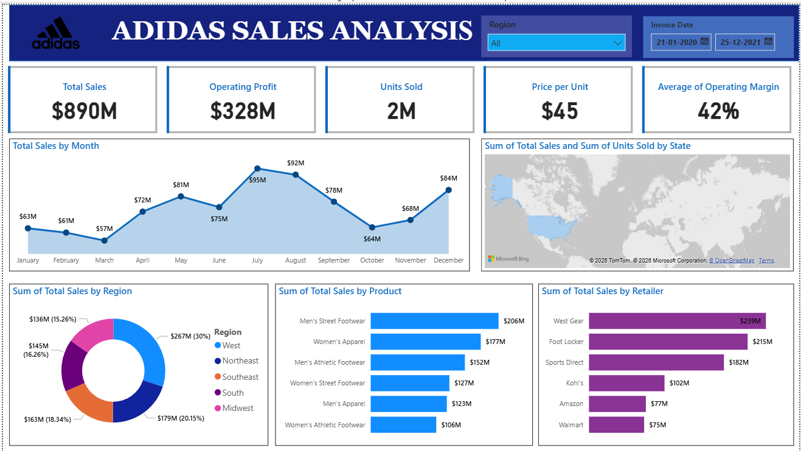

# Adidas_Sales_Dashboard
Adidas Sales Analysis Dashboard built using Power BI to visualize sales performance across regions, products, and retailers. The dashboard highlights key KPIs such as total sales, profit, units sold, and operating margin with interactive filters, monthly trends, and geographic insights for data-driven decision making.
https://github.com/prabhat-yadav1/Adidas_Sales_Dashboard/blob/main/Adidas_sales_dashboard.png

Adidas Sales Analysis Dashboard

This project presents an interactive Adidas Sales Analysis Dashboard built using Power BI. The goal of this dashboard is to analyze sales performance, operating profit, product demand, and regional performance to support better business decisions.

The dashboard provides a clear overview of key business metrics such as Total Sales, Operating Profit, Units Sold, Price per Unit, and Average Operating Margin. These KPIs help quickly understand the overall performance of Adidas sales.

The dashboard also includes multiple visualizations to explore the data in detail. A monthly sales trend chart shows how sales change throughout the year, helping identify peak and low-performing months. A geographical map displays sales distribution by state to understand regional performance.

In addition, the dashboard analyzes sales by region, product category, and retailer. This helps identify which regions generate the highest revenue, which products are most popular, and which retailers contribute the most to total sales.

Interactive filters such as Region and Invoice Date allow users to dynamically explore the data and gain deeper insights.

Key Insights

Total Sales: $890M

Operating Profit: $328M

Units Sold: 2M

Average Operating Margin: 42%

Tools Used

Power BI

Data Visualization

Data Analysis

Purpose

The main objective of this project is to demonstrate data analysis and visualization skills by transforming raw sales data into meaningful business insights using Power BI.

